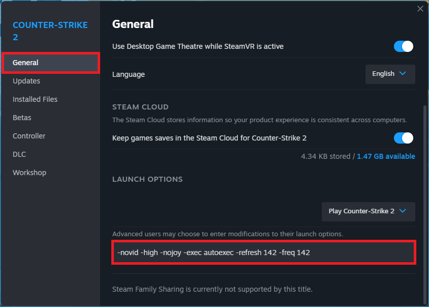

<p align="center">
  
</p>

<p align="center">
  <a href="#-features">Features</a> •
  <a href="#-architecture">Architecture</a> •
  <a href="#-quick-start">Quick Start</a> •
  <a href="#-api-documentation">API</a> •
  <a href="#-contributing">Contributing</a>
</p>

---

## 👖 Vanilla Slops?

**Vanilla Slops** is a web application that provides a searchable database of community-verified launch options for games on [Steam](https://store.steampowered.com/).
s
The name Vanilla Slops is a nod to the use of vanilla JavaScript, with our back-end powered by an Express.js API and Supabase (PostgreSQL).

The core philosophy of this project aims to recreate some of the functionality that modern frameworks abstract away, while remaining lightweight, fast, and secure.

Steam Launch Options (SLOPS) are custom command-line parameters that can improve game performance or unlock features outside of the standard game menus.



---

## 🐸 Features

#### **🔎 Smart Search & Discovery**
- **Real-time search suggestions** across titles, developers, publishers with instant results
- **Custom filtering** by category, engine, release year, and launch options

#### **🍓 Steam Launch Options Database**
- **Categorized by purpose**: Performance boosting, graphics optimization, compatibility fixes
- **Source attribution** linking back to original documentation and community contributions

#### **🛡️ Code Quality & Safety**
- **Accessibility-first design** with semantic HTML and full keyboard navigation
- **Security hardened** with input validation, CORS policies, and rate limiting
- **Type-safe architecture** using Zod schemas throughout the stack

---

## 🏗️ Architecture

#### **A Look Under the Hood**
- **Frontend**: Vanilla JavaScript (ES6+) with Vite for development
- **Backend**: Node.js + Express.js with middleware-based architecture
- **Database**: Supabase (PostgreSQL) with optimized queries and indexing
- **Data Collection**: Python-based scraper with Steam API integration


---

## 🧙 Quick Start

### Installation

```bash
# Clone the repository
git clone https://github.com/soundwanders/vanilla-slops.git
cd vanilla-slops

# Install dependencies
npm install

# Set up environment variables
cp .env.example .env
# Then, add your Supabase credentials to the new .env file
```

### Environment Configuration

```bash
# Example .env
SUPABASE_URL=your_supabase_project_url
SUPABASE_SERVICE_ROLE_KEY=your_service_role_key
NODE_ENV=development
PORT=8000
CORS_ORIGIN=placeholder.com
DOMAIN_URL=placeholder.com
```

### Development & npm Scripts

| Command | Description |
|---------|-------------|
| `npm run dev` | **Start full dev environment** (client + server) |
| `npm run dev:client` | Start Vite dev server only |
| `npm run dev:server` | Start backend with nodemon only |
| `npm run build` | **Build for production** |
| `npm start` | **Run production server** |
| `npm test` | Run tests (placeholder) |
| `npm run lint` | Check code with ESLint |
| `npm run lint:fix` | Fix ESLint issues automatically |

---

## 📚 API Documentation

**👉 [Full API Documentation](./docs/api.md)**

#### Quick Reference

| Endpoint | Description |
|----------|-------------|
| `GET /api/games` | List games with filtering & search |
| `GET /api/games/suggestions` | Search autocomplete suggestions |
| `GET /api/games/{id}` | Get game details with launch options |
| `GET /api/games/{id}/launch-options` | Get launch options only |
| `GET /api/games/facets` | Get available filter options |
| `GET /health` | API health check |

#### **`GET /api/games`**
Retrieve games with advanced filtering and pagination.

**Query Parameters:**
- `search` - Search term for games, developers, publishers
- `developer` - Filter by developer name
- `options` - Filter by launch options (`has-options`, `no-options`, `performance`, `graphics`)
- `year` - Filter by release year
- `sort` - Sort field (`title`, `year`, `options`, `relevance`)
- `order` - Sort direction (`asc`, `desc`)
- `page` - Page number (default: 1)
- `limit` - Items per page (default: 20, max: 100)

**Response:**
```json
{
  "games": [
    {
      "app_id": 440,
      "title": "Team Fortress 2",
      "developer": "Valve",
      "total_options_count": 15
    }
  ],
  "total": 1250,
  "totalPages": 63,
  "currentPage": 1,
  "hasNextPage": true,
  "facets": {
    "developers": [{"value": "Valve", "count": 12}],
    "engines": [{"value": "Source", "count": 5}]
  }
}
```

#### **`GET /api/games/{id}/launch-options`**
Retrieve launch options for a specific game.

**Response:**
```json
[
  {
    "id": "uuid-here",
    "command": "-windowed",
    "description": "Runs the game in windowed mode",
    "upvotes": 245,
    "verified": true
  }
]
```

---

## 🧘 Contributing

Vanilla Slops is a welcoming place for all developers. No matter whether you're a greenhorn or an old sage, I would love to hear your ideas. 
Your contributions can only make the project better, and maybe we'll both learn something along the way. 

[📋 **Contributing Guidelines**](./CONTRIBUTING.md) | [🐛 **Issue Templates**](./github/ISSUE_TEMPLATE/)

### **Ways to Contribute**
- 🎮 **Launch Options** - Submit verified launch options for games, so we can grow the database
- 🐛 **Bug Reports** - Issues, broken things, silly things, or things that just don't make no sense
- ✨ **Feature Requests** - Any ideas for new features, or improving on currently implemented features
- 📝 **Documentation** - Help improve our docs and test-coverage

### **Example Workflow**
1. Fork the repository
2. Create a feature branch (`git checkout -b feature/amazing-feature`)
3. Make your changes with tests
4. Commit with conventional commits (`git commit -m 'feat: add amazing feature'`)
5. Push to your branch (`git push origin feature/amazing-feature`)
6. Open a Pull Request

---

## 📄 License

MIT License - please see the [LICENSE](LICENSE) file for details.

---

<p align="center">
  <br/>
  <sub>Built with ❤︎</sub> <br/>
</p>